# ATS Resume Audit Report
**Candidate Profile:** Soul (Bokka Mohan Kiran) — DevOps / Backend Engineer  
**Audit Date:** July 2026  
**Target Roles:** DevOps Engineer, Backend Engineer, Cloud Platform Engineer

---

## 📊 ATS Parseability Score: 88 / 100

Your resume has a strong foundation. Because it follows the single-column rule, utilizes plain text, and avoids graphic elements, progress bars, or tables (which confuse ATS parsers), it achieves an excellent initial parse rate. However, there are a few critical gaps that will drop your score or trigger automatic rejections in corporate systems.

```mermaid
gantt
    title ATS Scoring Breakdown
    dateFormat  X
    axisFormat %d
    
    Layout & Structure (Max 30)       :active, l1, 0, 30
    Keyword Density (Max 30)          :active, l2, 0, 26
    Contact Info Integrity (Max 20)   :active, l3, 0, 12
    Experience Classification (Max 20) :active, l4, 0, 20
```



---

## 🔍 How the ATS Parser Sees Your Resume

### 1. Contact Information Extraction
*   **Name:** `Soul` (Parsed successfully. *Warning: Ensure this matches your legal name on applications, e.g., Bokka Mohan Kiran, to avoid background check mismatches*).
*   **Email:** `SoulByte07@protonmail.com` (Parsed successfully).
*   **LinkedIn:** `linkedin.com/in/SoulByte07` (Parsed successfully).
*   **GitHub:** `github.com/SoulByte07` (Parsed successfully).
*   **Phone Number:** ❌ **MISSING**.
    > [!WARNING]
    > **Critical Failure:** Many corporate ATS platforms (like Workday, Taleo, and Greenhouse) flag profiles without phone numbers as "incomplete contact information" and prevent HR from moving them to the next stage, or filter them out entirely.
*   **Location/Country:** ❌ **MISSING in Header**. (Parsed from Education: `Andhra Pradesh, India`).
    > [!TIP]
    > Add a city/country to your header (e.g., `Andhra Pradesh, India` or `Remote, India`). ATS systems often run radius searches (e.g., "within 50 miles of Bangalore") to match local candidates.

---

### 2. Section Mapping & Parser Trajectory

Older ATS systems scan resumes sequentially and categorize blocks of text using heuristic headers. Here is how your sections map:

| Resume Section Header | ATS Parser Classification | Confidence Level |
| :--- | :--- | :--- |
| `PROFILE SUMMARY` | Summary / Executive Summary | High |
| `KEY SKILLS` | Skills / Competencies Vector | High |
| `PROJECTS` | Projects / Experience | **Medium** |
| `EDUCATION` | Education History | High |
| `CERTIFICATIONS` | Certifications & Credentials | High |

#### The "Work Experience" Classification Trap:
Because you do not have a section labeled `WORK EXPERIENCE` or `EMPLOYMENT HISTORY`, the ATS parser will classify your `PROJECTS` as personal projects rather than professional experience. 
If a job description requires *"1+ years of experience in backend development,"* the parser may calculate your total work experience as **0 years**, which can lead to automatic rejection.

---

### 3. Keyword Match Density (For DevOps & Backend Roles)

We scanned your resume against standard Job Descriptions (JDs) for Junior DevOps / Backend roles. Here are the match rates:

| Tech Skill Category | Keywords Found | Match Status | Action / Suggestions |
| :--- | :--- | :--- | :--- |
| **IaC & Automation** | `Terraform`, `LocalStack` | ✅ Strong | Excellent representation. |
| **Cloud Platforms** | `AWS`, `EC2`, `VPC`, `S3`, `RDS`, `CloudFront`, `CloudWatch`, `Route 53`, `ALB`, `ASG`, `WAF` | ✅ Outstanding | Very high match rate for AWS-based roles. |
| **Languages** | `Python`, `Bash`, `Java`, `Go`, `SQL` | ✅ Good | Add `Go` projects soon as it is listed in your skills but not in your projects. |
| **Containerization** | `Docker`, `Docker Compose`, `Podman`, `Buildah` | ✅ Strong | Good representation of container runtimes. |
| **CI/CD** | `GitHub Actions`, `Jenkins` | ✅ Good | Standard keywords. |
| **Database** | `PostgreSQL`, `SQL`, `MySQL` | ✅ Good | Excellent database coverage. |
| **Orchestration** | None | ❌ **Missing** | Add `Kubernetes` or `K8s` once you start learning it, as it is a core DevOps requirement. |

---

## 🛠️ Optimization Recommendations

### Red Flag 1: Embedded URLs in Section Headers
You formatted your project titles like this:
`### AWS Scalable Web Architecture (Vocal4Local Migration) (https://github.com/...)`
> [!CAUTION]
> Many ATS parsers fail when reading URLs inside heading levels. They read the URL as part of the project title (e.g., parsing the project name as `AWS Scalable Web Architecture ... https://...`), which confuses the job matching algorithm.
> 
> **Fix:** Keep the header clean and place the GitHub link inside the bullet points or as a sub-text link.

### Red Flag 2: Skill Section without Context
Your skills are listed as a bulleted list of words. While this passes keyword parsers, human recruiters prefer categorized groupings.
**Fix:** Group them into standard domains: `Cloud & Infrastructure`, `Backend & Languages`, `CI/CD & Containers`. (Your resume already does this well, but ensure the formatting stays clean).

---

## 📝 Actionable Diffs

Here is how you should adjust the header and project formatting in your [Resume.tex](file:///home/soul/01_Projects/98_Misc/Resume/Resume.tex) or [Resume.md](file:///home/soul/01_Projects/98_Misc/Resume/Resume.md):

### 1. Header Optimization
```diff
---
-Soul
-DevOps / Backend Engineer
-SoulByte07@protonmail.com
-linkedin.com/in/SoulByte07 | github.com/SoulByte07
+Bokka Mohan Kiran (Soul)
+DevOps / Backend Engineer
+SoulByte07@protonmail.com | +91 XXXXXXXXXX | Andhra Pradesh, India
+linkedin.com/in/SoulByte07 | github.com/SoulByte07
---
```

### 2. Experience Section Re-framing (To Bypass the "0 Years Experience" Trap)
If you have worked on these projects as part of college research groups, freelance work, or open-source contributions, frame the section to emphasize *Engineering Experience*:
```diff
-## PROJECTS
-
-### AWS Scalable Web Architecture (Vocal4Local Migration) (https://github.com/SoulByte07/AWS-Scalable-Web-Architecture.git)
-> AWS (Route 53, CloudFront, ALB, ASG, RDS Multi-AZ), Terraform, SOPS
+## TECHNICAL PROJECTS & EXPERIENCE
+
+### AWS Scalable Web Architecture — Vocal4Local Migration
+*Project Link: [github.com/SoulByte07/AWS-Scalable-Web-Architecture](https://github.com/SoulByte07/AWS-Scalable-Web-Architecture)*
+*Technologies: AWS (Route 53, CloudFront, ALB, ASG, RDS Multi-AZ), Terraform, SOPS*
```

This ensures the ATS reads `AWS Scalable Web Architecture` as the job/project title and correctly separates the URL from the text.
