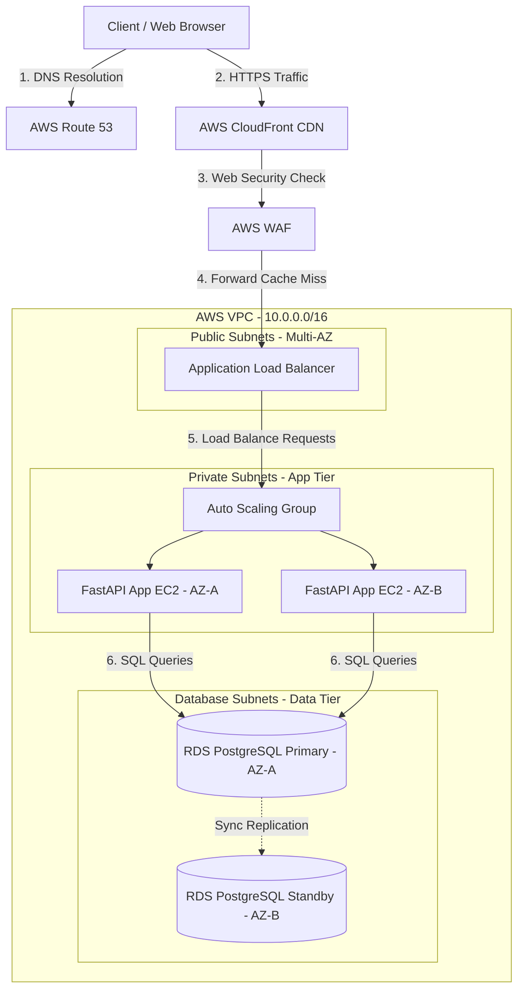
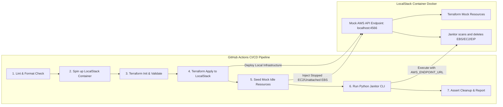
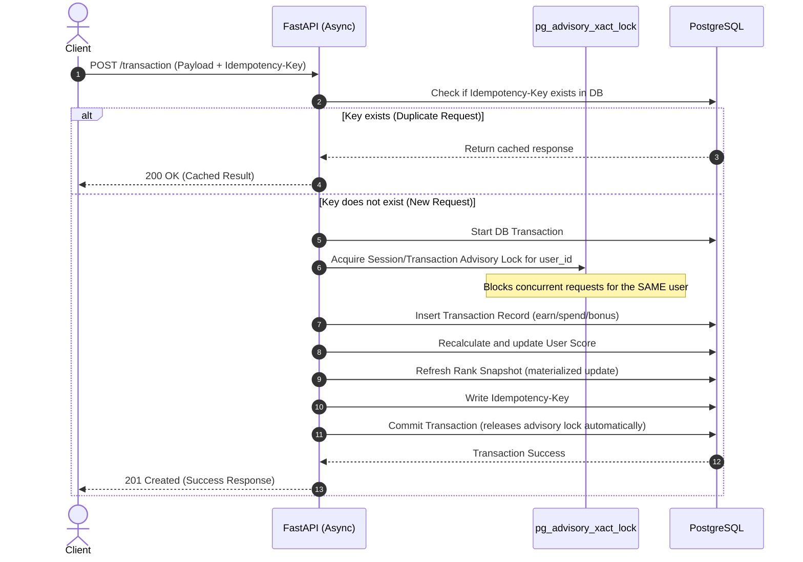
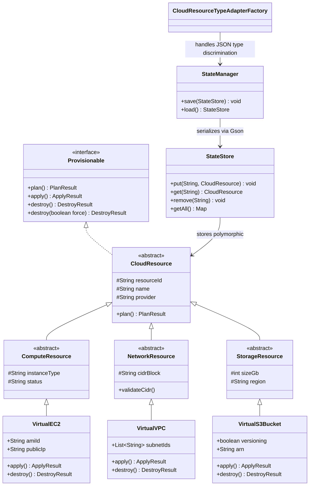

# Interview Preparation Master Guide
**Candidate:** Bokka Mohan Kiran (Soul)  
**Role Target:** DevOps / Backend Engineer  
**Date:** July 2026

---

## Table of Contents
1. [Elevator Pitch & Introduction](#1-elevator-pitch--introduction)
2. [Project 1: AWS Scalable Web Architecture (Vocal4Local Migration)](#2-project-1-aws-scalable-web-architecture-vocal4local-migration)
3. [Project 2: Multi-Cloud Cost Hygiene Automation](#3-project-2-multi-cloud-cost-hygiene-automation)
4. [Project 3: RankGuard – Async Transaction Processor & Leaderboard](#4-project-3-rankguard--async-transaction-processor-leaderboard)
5. [Project 4: OmniSync – Distributed Log Aggregator (Ongoing)](#5-project-4-omnisync--distributed-log-aggregator-ongoing)
6. [Project 5: Mini-Terraform – Java IaC Simulator (Ongoing)](#6-project-5-mini-terraform--java-iac-simulator-ongoing)
7. [Technical Core Concepts Cheat Sheet](#7-technical-core-concepts-cheat-sheet)
8. [Behavioral & HR Interview Preparation](#8-behavioral--hr-interview-preparation)
9. [Questions to Ask the Interviewer](#9-questions-to-ask-the-interviewer)
10. [Future Learning Roadmap](#10-future-learning-roadmap)

---

## 1. Elevator Pitch & Introduction

### "Tell Me About Yourself" Pitch (1.5 Minutes)
> *"Hi, I'm Mohan Kiran. I am a DevOps and Backend Engineer specializing in building resilient, highly available cloud infrastructures and high-concurrency backend services. I’m currently completing my B.Tech in Computer Science and Engineering, during which I've focused intensely on real-world engineering challenges.*
>
> *Over the past couple of years, I've worked on three primary areas: AWS-based highly available architectures, infrastructure automation with LocalStack and Terraform, building scalable async backend APIs using Python and FastAPI, and systems-level programming in Go.*
> 
> *Specifically, I have:*
> 1. *Designed and migrated legacy monolithic systems to multi-availability-zone AWS architectures using Terraform, reducing downtime and latency while securing the network via AWS WAF and private subnet isolation.*
> 2. *Automated multi-cloud cost hygiene by building a local-first testing workflow in LocalStack and writing a custom Python Janitor CLI to safely scan and tear down idle cloud assets in CI/CD pipelines.*
> 3. *Engineered RankGuard, an async transactional backend in FastAPI and PostgreSQL that guarantees exactly-once transaction processing under load using idempotency keys and per-user concurrency locks.*
> 4. *Built OmniSync, a distributed log aggregator and metrics collector in Go that uses goroutines and channels for concurrent agent-to-aggregator telemetry streaming, and Mini-Terraform, a Java CLI that simulates Terraform's plan/apply/destroy lifecycle with JSON state persistence.*
>
> *I love working at the intersection of backend systems and infrastructure engineering. I focus on optimizing performance, securing systems, and maintaining clean, well-tested automation. I'm excited about this role because it will allow me to apply these infrastructure-as-code and backend concurrency skills to solve scaling challenges in production."*

---

## 2. Project 1: AWS Scalable Web Architecture (Vocal4Local Migration)

### System Architecture Diagram


### Project Deep Dive (STAR Method)
*   **Situation:** The business was running a monolithic, single-server legacy web application. This architecture introduced 4 major business risks: high latency for international users, vulnerability to traffic spikes, data loss risk from single-point-of-failure database architecture, and security exposure from exposing database endpoints to the public internet.
*   **Task:** Migrate the application to a resilient, highly available 3-tier AWS architecture using Infrastructure as Code (Terraform), while incorporating global edge caching, automated auto-scaling, and secure secret management.
*   **Action:**
    *   Provisioned an AWS VPC with public subnets (for Application Load Balancer), private subnets (for EC2 application servers), and database subnets.
    *   Configured an Application Load Balancer (ALB) and Auto Scaling Group (ASG) spans across two Availability Zones (Multi-AZ) to automatically scale EC2 application nodes based on target CPU metrics.
    *   Deployed Amazon RDS PostgreSQL in a Multi-AZ configuration to support synchronous block-level replication and automated failover.
    *   Set up AWS CloudFront to serve static content using global edge locations, decreasing load on backend servers.
    *   Configured AWS WAF to filter malicious payloads and SQL injection attempts.
    *   Used **Mozilla SOPS** (Secrets on Kubernetes/Local Environments) with AWS KMS to encrypt sensitive credentials (like database passwords) directly within the Git repository, decrypting them dynamically during deployment.
*   **Result:** Eliminated all 4 business risks. Achieved zero-downtime database failover, decreased average page load times for international users via CloudFront caching, and completely isolated backend data layers from the public internet.

---

### Technical Interview Q&A

#### Q1: What is a 3-Tier Architecture, and why is it preferred over a monolithic setup?
**Answer:** A 3-tier architecture divides an application into three logical and physical layers:
1.  **Presentation Tier:** The entry point (e.g., CloudFront CDN and Application Load Balancer) that handles client interactions and SSL termination.
2.  **Application Tier:** The business logic (e.g., EC2 instances running FastAPI inside private subnets).
3.  **Data Tier:** The storage engine (e.g., RDS PostgreSQL instances located in dedicated database subnets).

This separation increases scalability (tiers can scale independently), improves security (only the presentation tier is exposed, and database instances have no public IPs), and increases fault tolerance.

#### Q2: How does RDS Multi-AZ differ from RDS Read Replicas?
**Answer:**
*   **RDS Multi-AZ** is a high-availability and disaster recovery solution. It provisions a secondary, standby DB instance in a different Availability Zone (AZ). Writes are **synchronously replicated** to the standby. If the primary instance fails, AWS automatically updates the DNS record to point to the standby, resulting in minimal downtime (typically under 60-120 seconds) and zero data loss. The standby instance cannot be read from or written to directly by the application.
*   **Read Replicas** are for performance scalability. Writes are **asynchronously replicated** from the primary database to one or more read replicas (which can be in the same AZ, different AZ, or different Region). Applications connect directly to read replicas to offload read traffic from the primary database. If the primary database fails, a read replica does not automatically fail over unless manually promoted or scripted via a controller.

#### Q3: Why and how did you use Mozilla SOPS? What is the advantage over AWS Secrets Manager?
**Answer:**
*   **Why/How:** Mozilla SOPS is an editor of encrypted files that supports formats like YAML, JSON, and INI. I used it to encrypt secrets (such as database credentials and API tokens) with a key managed by AWS KMS (Key Management Service). The encrypted secret files were committed safely to Git. During deployment, the CI/CD pipeline used the AWS IAM role to call AWS KMS to decrypt the files dynamically.
*   **Advantage:** Cost efficiency and simplicity. Using AWS Secrets Manager incurs a monthly charge per secret plus API request fees. SOPS is free, runs locally, keeps configurations alongside the application code in version control (GitOps style), and avoids runtime latency since decrypted configurations are loaded into the application's environment variables at startup.

#### Q4: How does the Auto Scaling Group (ASG) know when to scale out (add servers) or scale in (terminate servers)?
**Answer:** ASG monitors metrics using AWS CloudWatch. I configured dynamic scaling policies:
*   **Target Tracking Scaling Policy:** The ASG adjusts its capacity to maintain a specific target metric (e.g., keeping average CPU utilization at 60%).
*   **Cooldown Periods:** Once a scale-out or scale-in action occurs, the cooldown period (e.g., 300 seconds) prevents the ASG from launching or terminating additional instances until the system stabilizes, avoiding "flapping" (rapidly scaling up and down).
*   **Health Checks:** The ASG monitors the health of the EC2 instances. If an instance fails the ALB HTTP target group health check (e.g., returning 5xx or failing to respond to `/health` three times), the ASG automatically terminates it and provisions a new one.

#### Q5: What is AWS WAF, and what specific rules did you implement?
**Answer:** AWS WAF (Web Application Firewall) inspects HTTP/HTTPS requests at the CloudFront or ALB level. I implemented:
*   **SQL Injection (SQLi) Protection:** Blocking requests containing malicious SQL fragments in query parameters or request bodies.
*   **Cross-Site Scripting (XSS) Mitigation:** Inspecting payloads for script injection patterns.
*   **IP Rate Limiting:** Blocking or throttling client IPs that send more than 100 requests per minute to protect against DDoS or brute-force attempts.

---

## 3. Project 2: Multi-Cloud Cost Hygiene Automation

### System Workflow Diagram


### Project Deep Dive (STAR Method)
*   **Situation:** Cloud development environments frequently accumulate unused or forgotten resources (orphaned EBS volumes, stopped EC2 instances, unassociated Elastic IPs), which directly inflates cloud bills. Testing automation scripts in real AWS environments during CI/CD runs can lead to slow execution, security risk exposure, and accidental real-world cloud spend.
*   **Task:** Create a local-first validation workflow that automates the detection and destruction of idle cloud assets, fully verified inside a GitHub Actions pipeline without incurring real AWS costs.
*   **Action:**
    *   Adopted **LocalStack** to mock AWS services (EC2, S3, EBS, VPC) locally.
    *   Wrote a **Python Janitor CLI** utilizing the `boto3` library to scan for three specific categories of waste:
        1.  *Unattached EBS Volumes:* Volumes with a status of `available` instead of `in-use`.
        2.  *Unassociated Elastic IPs (EIPs):* Allocations lacking an `AssociationId`.
        3.  *Stopped EC2 Instances:* Instances that have been stopped for longer than a specified threshold.
    *   Implemented **Dry-Run Safety** (logs what it *would* delete without executing changes) and a **Protected-Tag Bypass** (skips resources with a tag like `Protected=true`).
    *   Automated infrastructure creation via Terraform, pointing to LocalStack endpoints (`localhost:4566`).
    *   Designed a 7-stage GitHub Actions pipeline that initializes LocalStack, applies Terraform configurations, runs the Python Janitor CLI, and validates that only the target idle resources were removed.
*   **Result:** Eliminated all real AWS costs associated with running test suites, automated the detection and cleanup of orphaned cloud resources, and established a pipeline standard to enforce infrastructure cost hygiene before deploying to production.

---

### Technical Interview Q&A

#### Q1: How does LocalStack mock AWS APIs, and how did you configure Terraform to point to it?
**Answer:** LocalStack runs as a lightweight container and exposes a unified endpoint (typically `http://localhost:4566`) that mimics real AWS REST APIs. 
To direct Terraform to LocalStack, I defined custom endpoint overrides inside the Terraform provider configuration block:
```hcl
provider "aws" {
  access_key                  = "mock_access_key"
  secret_key                  = "mock_secret_key"
  region                      = "us-east-1"
  skip_credentials_validation = true
  skip_metadata_api_check     = true
  skip_requesting_account_id  = true

  endpoints {
    ec2 = "http://localhost:4566"
    s3  = "http://localhost:4566"
  }
}
```

#### Q2: Explain the logic you used in Python `boto3` to scan for the 3 resource types.
**Answer:** I used the standard `boto3` client SDK:
1.  **Unattached EBS Volumes:**
    ```python
    ec2 = boto3.client('ec2')
    volumes = ec2.describe_volumes(Filters=[{'Name': 'status', 'Values': ['available']}])
    # Available status indicates they are not attached to any EC2 instance.
    ```
2.  **Unassociated EIPs:**
    ```python
    addresses = ec2.describe_addresses()
    unassociated_eips = [ip for ip in addresses['Addresses'] if 'AssociationId' not in ip]
    ```
3.  **Stopped EC2 Instances:**
    ```python
    instances = ec2.describe_instances(Filters=[{'Name': 'instance-state-name', 'Values': ['stopped']}])
    # From here, I extract LaunchTime or state change transition logs to check duration.
    ```

#### Q3: Why is "Dry-Run Safety" important in janitor/cleaner scripts, and how did you build it?
**Answer:** Dry-run safety prevents accidental data loss or disruption. If an administrator runs the janitor script without dry-run turned off, a bug in the script could destroy critical production infrastructure. 
I built it by implementing a boolean CLI argument `--dry-run` (defaulting to `True` for safety). When `True`, the script calls the AWS APIs with `DryRun=True` (supported by many EC2 delete actions) or simulates the deletion log without calling the write/delete APIs:
```python
if dry_run:
    print(f"[DRY-RUN] Would delete EBS Volume {volume_id}")
else:
    ec2.delete_volume(VolumeId=volume_id)
    print(f"[DELETED] Volume {volume_id}")
```

#### Q4: What is the difference between Docker, Podman, and Buildah?
**Answer:**
*   **Docker:** Runs a centralized daemon (`dockerd`) with root privileges to manage all container runtimes, builds, and networks.
*   **Podman (Pod Manager):** A daemonless container engine that operates directly on OCI container runtimes. It runs rootless by default, increasing host-system security. Its CLI commands are fully compatible with Docker.
*   **Buildah:** A specialized tool designed for building OCI-compliant container images without relying on a full container runtime or daemon. Unlike Docker (which requires a `Dockerfile`), Buildah allows you to build images step-by-step using standard shell scripts (e.g., using host-system tools to copy files directly into a container mount).

---

## 4. Project 3: RankGuard – Async Transaction Processor & Leaderboard

### Concurrency & Transaction Flow Diagram


### Project Deep Dive (STAR Method)
*   **Situation:** Financial or gaming transaction systems often suffer from race conditions. If a user hits a transaction endpoint twice rapidly (double-click), or if network retries occur, it can result in duplicate transactions (double-spend/double-earn) or inaccurate leaderboard rankings due to dirty database reads.
*   **Task:** Build a high-performance backend API that guarantees exactly-once processing (idempotency) and processes scoring updates securely under concurrent loads, maintaining a dynamic, consistent user leaderboard.
*   **Action:**
    *   Selected **FastAPI** to benefit from its asynchronous ASGI performance and native integration with Python's `asyncio` event loop.
    *   Designed a database schema in **PostgreSQL** containing 4 core tables: `users`, `transactions`, `scores`, and `idempotency_keys`.
    *   Used **SQLAlchemy 2.0**'s async session model to prevent blocking I/O calls during database operations.
    *   Guaranteed exactly-once semantics by inspecting incoming requests for an `Idempotency-Key` header and storing the resulting payloads.
    *   Mitigated concurrent race conditions for individual users by using **PostgreSQL transaction-level advisory locks** (`pg_advisory_xact_lock`), which queue concurrent requests targeting the same user ID.
    *   Optimized leaderboard performance using materialized database views updated atomically rather than querying live window functions (`RANK()`) for every user request.
    *   Managed migrations with **Alembic** and wrote an integration test suite with **pytest-asyncio** to validate concurrency handling.
*   **Result:** Achieved 100% data consistency (no duplicate transactions, no race conditions) across concurrent client workloads, validated by robust automated integration testing.

---

### Technical Interview Q&A

#### Q1: What is the difference between concurrency and parallelism in Python?
**Answer:**
*   **Concurrency** is about dealing with multiple tasks at once. In Python, this is handled via **asyncio** (single-threaded event loop). When an async function reaches an I/O operation (e.g., waiting for database queries or API responses), it yields control back to the event loop using the `await` keyword. This allows the event loop to run other tasks in the meantime. It is ideal for I/O-bound applications.
*   **Parallelism** is about doing multiple things at the same time. Because of Python's **Global Interpreter Lock (GIL)**, true parallelism for CPU-bound tasks cannot be achieved in a single process. Instead, you must use the `multiprocessing` module to spin up separate OS processes, each with its own Python interpreter and memory space, allowing them to run on multiple CPU cores.

#### Q2: How do Idempotency Keys prevent duplicate transaction processing?
**Answer:** An idempotency key is a unique identifier (typically a UUIDv4) generated by the client and sent in the request header. 
1.  When a request arrives, the server checks the `idempotency_keys` table.
2.  If the key is found, the server immediately returns the cached response (e.g., `200 OK` with the response body) without executing the transaction code.
3.  If the key is not found, the server executes the transaction, saves the key and the final response payload in the table inside the database transaction, and returns the response.
This protects the backend from processing duplicate actions if the client retries a request due to network timeouts.

#### Q3: Why did you use PostgreSQL Advisory Locks instead of standard row-level locking (SELECT ... FOR UPDATE)?
**Answer:**
*   `SELECT ... FOR UPDATE` locks a specific, existing row in a database table. However, it cannot prevent the creation of *new* duplicate records (insert race conditions) for a user if the row does not exist yet.
*   **Advisory Locks** are application-defined locks created in PostgreSQL. They don't lock actual database rows. Instead, they lock an arbitrary integer or 64-bit key (e.g., the User's ID).
*   By executing `SELECT pg_advisory_xact_lock(user_id)` at the start of a transaction, any subsequent incoming request attempting to lock the same `user_id` is blocked and queued until the active transaction completes and commits, preventing any race conditions on inserts or updates for that specific user.

#### Q4: How does Alembic handle schema migrations, and what are autogenerate limitations?
**Answer:** Alembic tracks database states via a history of migration scripts.
*   **Autogenerate** compares the metadata of your SQLAlchemy models with the actual database schema and automatically writes the migration script (`upgrade()` and `downgrade()` functions).
*   **Limitations:** Autogenerate cannot detect custom table constraints, index types, custom column renaming, or database-specific types (like ENUMs or materialized views) reliably. These must be manually coded into the migration files.

#### Q5: What is the N+1 query problem in SQLAlchemy, and how do you solve it?
**Answer:** The N+1 query problem occurs when you fetch a parent object and then loop through its children, causing the ORM to execute one query to fetch the parents plus "N" separate queries to fetch the children of each parent.
*   **Solution:** Use eager loading strategies during the query:
    *   `selectinload()`: Ideal for one-to-many relationships; executes a second query using an `IN` clause to fetch all children.
    *   `joinedload()`: Ideal for many-to-one relationships; executes a SQL `JOIN` in a single query.

---

## 5. Project 4: OmniSync – Distributed Log Aggregator (Ongoing)

### System Architecture Diagram
```mermaid
graph TD
    subgraph Agent [Agent Binary - deployed per host]
        Collector[Metrics Collector<br/>gopsutil/v4] -->|every 5s| metricsCh[(metricsCh buf=1)]
        Tailer[Log Tailer<br/>polling reader] -->|new lines| logsCh[(logsCh buf=64)]
        metricsCh -->|UDP :9001| US[UDP Sender]
        logsCh -->|TCP :9002| TS[TCP Sender]
    end

    subgraph Network [Dual Transport]
        US -- "fire-and-forget" --> UL[Aggregator UDP Listener]
        TS -- "persistent conn" --> TL[Aggregator TCP Listener]
    end

    subgraph Aggregator [Aggregator Binary]
        UL --> aggMetricsCh[(metricsCh buf=16)]
        TL --> aggLogsCh[(logsCh buf=128)]
        aggMetricsCh & aggLogsCh --> FanIn[Fan-in Goroutine<br/>select {}]
        FanIn --> Store[JSONL File Store<br/>central_store.jsonl]
    end
```

### Project Deep Dive (STAR Method)
*   **Situation:** Production log aggregation and system monitoring tools (ELK, Datadog, Prometheus + Grafana) are heavyweight for small-scale distributed environments. They require significant infrastructure, configuration overhead, and licensing costs that are prohibitive for learning environments and small deployments.
*   **Task:** Build a lightweight, concurrent distributed log aggregator and system metrics collector in Go that demonstrates production-grade systems programming patterns (goroutines, channels, dual-transport protocol, hexagonal architecture) while remaining deployable as a single binary.
*   **Action:**
    *   Designed two standalone binaries — **Agent** (per-host collector) and **Aggregator** (central receiver) — communicating over separate transports: UDP (fire-and-forget for metrics) and TCP (ordered delivery for logs).
    *   Implemented the metrics collector using `gopsutil/v4` to capture CPU percentage, memory usage, hostname, and epoch millisecond timestamps, with a unit-tested `CollectMetrics(ctx)` function.
    *   Built a log tailer that opens a file, seeks to end, polls every second for new content, and streams lines over a channel — respecting context cancellation for graceful shutdown.
    *   Modeled all shared domain types (`Metrics`, `LogEntry`) in a dedicated `models` package with JSON tags for wire serialization.
    *   Designed the aggregator with a fan-in concurrency pattern: a single goroutine uses `select` to read from both metrics and log channels, serializing writes to a JSON Lines file (`central_store.jsonl`) to avoid lock contention.
    *   Containerized with Docker (multi-stage build) and automated with a `Makefile` covering `build`, `test`, `lint`, `run-agent`, `run-agg`.
*   **Result:** A working 10% scaffold (Phase 1 complete — shared models, metrics collector tested) with a detailed architecture document spanning 1050+ lines including 7 ADRs, C4 diagrams, capacity planning, and edge-case analysis. Demonstrates Go's concurrency model (goroutines + channels) for telemetry pipelines and systems-level programming.

---

### Technical Interview Q&A

#### Q1: Go concurrency model — goroutines vs OS threads, and channels vs mutexes — when do you use each?
**Answer:**
*   **Goroutines vs Threads:** Goroutines are lightweight, user-space "green threads" multiplexed onto a smaller pool of OS threads by Go's runtime scheduler. They start with a tiny stack (~4KB, growable) and have negligible creation cost. OS threads have a fixed 1MB+ stack and expensive context switches. You can run hundreds of thousands of goroutines; you cannot do the same with threads.
*   **Channels vs Mutexes:** Channels are for communicating ownership and signaling between goroutines (CSP model — "Don't communicate by sharing memory; share memory by communicating"). Mutexes protect shared state. Use channels when goroutines need to coordinate/signal (like passing metrics from collector to sender). Use mutexes for protecting cached state that multiple goroutines read/write. In OmniSync, the fan-in goroutine uses channels because ownership of each data item transfers cleanly from listener → fan-in → store.

#### Q2: Why dual transport — UDP for metrics and TCP for logs? Why not one protocol for both?
**Answer:**
*   **Metrics (UDP):** Metrics are continuous samples (CPU, memory at 5s intervals). Losing a single datagram is acceptable — the next sample arrives shortly. UDP has zero connection overhead, lower latency, and no backpressure, which is ideal for high-frequency telemetry from many agents.
*   **Logs (TCP):** Log lines are discrete, ordered events. Losing a log line means losing audit-trail evidence. TCP guarantees delivery and ordering via sequence numbers and retransmission. The persistent connection also gives the aggregator a way to detect agent disconnection.
*   This is the same pattern used in production systems: StatsD uses UDP for metrics; syslog-ng and Fluentd use TCP for logs.

#### Q3: Explain the fan-in concurrency pattern used in the aggregator. Why is it better than multiple writers with a mutex?
**Answer:** The fan-in pattern uses a single goroutine that `select`s on both the metrics channel and the log channel, calling `store.Write()` for whichever data arrives first. This is better than multiple writer goroutines sharing a mutex because:
1. **No lock contention** — exactly one goroutine touches the file at any time.
2. **Natural batching** — the goroutine can accumulate a small buffer before flushing.
3. **Simpler reasoning** — no deadlock or livelock scenarios to debug.
4. **Graceful shutdown** — the goroutine can drain both channels on `ctx.Done()` before closing the file.

The aggregator's `metricsCh` (buffer=16) and `logsCh` (buffer=128) absorb transient bursts, and the fan-in goroutine writes them serially to `central_store.jsonl`.

#### Q4: Go vs Python for a systems-level project like OmniSync — what made you choose Go?
**Answer:**
*   **Performance:** Go compiles to a native binary with no interpreter or VM overhead. CPU-bound loops and frequent syscalls (file I/O, network) are 10-50x faster than Python.
*   **Concurrency:** Go has goroutines and channels built into the language. Python requires `asyncio` (single-threaded, cooperative multitasking) or `multiprocessing` (separate processes, high overhead) for concurrency.
*   **Deployment:** Go produces a statically-linked binary (~8MB) with zero dependencies. Python requires a runtime, virtual environment, and installed packages — fragile for distributed deployment.
*   **Systems access:** Go's `gopsutil` and `golang.org/x/sys` provide direct OS-level metrics (CPU, memory, disk) that Python would need `psutil` (C extension) for, with slower FFI overhead.
*   **Trade-off:** Python is faster for prototyping and has richer data science/ML libraries. For a distributed telemetry agent that needs to be lightweight and concurrent, Go is the correct choice.

---

## 6. Project 5: Mini-Terraform – Java IaC Simulator (Ongoing)

### System Class Hierarchy & Workflow Diagram


```mermaid
graph LR
    subgraph CLI [CLI Layer - Not Yet Implemented]
        DesiredJSON[desired.json] --> Parser[DesiredConfigParser]
        Parser --> Engine[ResourceEngine]
    end

    subgraph Engine [Engine Layer - Not Yet Implemented]
        Engine -->|diff desired vs state| Plan
        Plan -->|list of Actions| Apply[Dispatch]
        Apply -->|CREATE| Create[resource.apply()]
        Apply -->|UPDATE| Update[old.destroy() + new.apply()]
        Apply -->|DELETE| Delete[old.destroy()]
    end

    subgraph State [State Persistence Layer - Implemented]
        StateManager -->|Gson| JSON[(terraform-state.json)]
        StateManager --> StateStore[In-Memory StateStore<br/>ConcurrentHashMap]
    end

    Apply -->|mutate| StateStore
    StateStore -->|save on apply| StateManager
```

### Project Deep Dive (STAR Method)
*   **Situation:** Many engineers use Terraform daily but few deeply understand its internal mechanics — how the plan/apply/destroy lifecycle works, how state is diffed and persisted, and how IaC tools model cloud resources as code. Building a simulator forces a complete understanding of these internals.
*   **Task:** Build a Java CLI that simulates Terraform's core workflow — define infrastructure as code, plan changes, apply them, and track state — using OOP principles (inheritance, polymorphism, encapsulation) and a Gradle build system.
*   **Action:**
    *   Designed a 4-level class hierarchy: `Provisionable` (interface) → `CloudResource` (abstract, with identity fields) → `ComputeResource`/`NetworkResource`/`StorageResource` (domain-specific abstracts) → `VirtualEC2`/`VirtualVPC`/`VirtualS3Bucket` (concrete resources with mock behavior).
    *   Implemented `plan()` → returns `PlanResult(resourceId, action)` where action is `CREATE|UPDATE|DELETE|NOOP`; `apply()` → mutates resource state (EC2 gets public IP, VPC provisions mock subnet IDs, S3 generates ARN); `destroy()` → reverses state; and `destroy(boolean force)` overloaded for EC2 (stopped vs terminated distinction).
    *   Built a full state persistence layer using **Gson** with a custom `CloudResourceTypeAdapterFactory` that injects a `"type"` discriminator key (`ec2`/`vpc`/`s3`) for polymorphic JSON serialization/deserialization to `terraform-state.json`.
    *   Implemented `StateStore` (thread-safe via `ConcurrentHashMap`) and `StateManager` (load/save with graceful missing-file handling).
    *   Wrote 12 unit tests (JUnit 5) covering all concrete resource lifecycle methods and state round-tripping.
*   **Result:** Core abstractions (Phase 0-2, ~41% complete) are implemented and tested. The resource hierarchy cleanly demonstrates OOP: abstraction via `Provisionable`, inheritance from `CloudResource` → domain → concrete, encapsulation of internal state (`publicIp`/`arn`/`subnetIds` only set during `apply()`), and polymorphism in the engine processing `List<CloudResource>` without type-switching.

---

### Technical Interview Q&A

#### Q1: What OOP concepts does Mini-Terraform demonstrate, and how?
**Answer:**
1. **Abstraction:** The `Provisionable` interface defines the lifecycle contract (`plan`, `apply`, `destroy`) without specifying how each resource implements it.
2. **Inheritance:** `VirtualEC2` extends `ComputeResource` extends `CloudResource`, inheriting `resourceId`, `name`, `provider` fields and default `plan()` behavior while adding AMI-specific fields.
3. **Encapsulation:** Internal resource state (`publicIp` for EC2, `arn` for S3) is private and only set during `apply()`. The CIDR block in `NetworkResource` is validated in the constructor before assignment.
4. **Polymorphism:** `ResourceEngine.process(List<CloudResource> resources)` calls `resource.apply()` on each element without knowing whether it's an EC2, VPC, or S3 — each concrete class provides its own implementation.
5. **Method Overloading:** `destroy()` (soft delete → stopped) vs `destroy(true)` (force delete → terminated) in `VirtualEC2`.

#### Q2: How does Terraform's plan/apply/destroy workflow work, and how does Mini-Terraform simulate it?
**Answer (Terraform internal workflow):**
1. **`terraform plan`**: Reads the user's `.tf` config files (desired state), reads the existing state file (current state), diffs them by resource ID. Produces an execution plan: resources to create (in desired but not in state), update (in both but changed), delete (in state but not in desired), or no-op (identical). This is a read-only operation — no changes are made.
2. **`terraform apply`**: Takes the plan and executes each action. For each resource, the provider's CRUD API is called. State is updated and persisted after successful apply.
3. **`terraform destroy`**: Reverses the plan — marks everything in state for deletion, executes `destroy()` on each resource, and clears the state file.

**Mini-Terraform simulation:** The `ResourceEngine` will generate a `Plan` containing `Action` objects (each with `ActionType`, the new resource, and the old resource if updating). `apply()` dispatches each action: CREATE calls `resource.apply()` and adds to `StateStore`; UPDATE calls `old.destroy()` then `new.apply()` and replaces in store; DELETE calls `resource.destroy()` and removes from store. The `StateManager` then persists the store to `terraform-state.json` using Gson. Currently the engine layer (Phase 3) is not yet implemented.

#### Q3: How does the `CloudResourceTypeAdapterFactory` handle polymorphic JSON serialization? What problem does it solve?
**Answer:** Gson (like most Java JSON libraries) cannot deserialize an abstract type (`CloudResource`) into the correct concrete subclass (`VirtualEC2`, `VirtualVPC`, or `VirtualS3Bucket`) without a type discriminator. The custom adapter solves this:

- **Serialization (write):** Uses a "plain" Gson to convert the concrete object to a `JsonObject`, then injects a `"type"` discriminator key (`"ec2"`, `"vpc"`, or `"s3"`) before writing.
- **Deserialization (read):** Reads the JSON into a `JsonObject`, extracts the `"type"` field, looks up the registered concrete class from a `Map<String, Class<?>>`, removes the `"type"` key, and delegates to plain Gson for the concrete type.

Without this adapter, Gson would either throw an error (cannot instantiate abstract class) or lose type information, silently deserializing everything into `CloudResource` with no subclass fields populated.

#### Q4: Why Java for this project rather than Go or Python, given your DevOps focus?
**Answer:** The goal of Mini-Terraform is not production IaC but deep understanding of OOP in a strongly-typed language. Java was chosen because:
1. **OOP is the language's DNA** — interfaces, abstract classes, generics, access modifiers are first-class concepts. Go's composition over inheritance would not demonstrate the same OOP hierarchy.
2. **Type safety at scale** — Java's static typing catches entire categories of errors at compile time (null safety, type mismatches), which is valuable for modeling complex domain hierarchies.
3. **Ecosystem** — Gradle + JUnit 5 + Gson is a mature, well-documented stack. The `application` plugin provides CLI packaging out of the box.
4. **Career relevance** — Many enterprise DevOps platforms (Jenkins, Elasticsearch, Kafka, Hadoop) are JVM-based. Understanding Java OOP is directly applicable to extending and debugging these tools.

## 7. Technical Core Concepts Cheat Sheet

### Cloud & DevOps Quick-Reference

| Concept | Explanation | Real-World Application |
| :--- | :--- | :--- |
| **VPC Peering vs Transit Gateway** | Peering is a 1-to-1 connection between two VPCs. Transit Gateway acts as a central hub connecting multiple VPCs and on-prem networks, simplifying routing rules at scale. | Use VPC Peering for small setups; use Transit Gateway when connecting more than 3-4 VPCs. |
| **Security Groups vs NACLs** | **Security Groups:** Stateful, operate at the instance/NIC level, support permit rules only. **NACLs:** Stateless, operate at the subnet level, support both permit and deny rules. | Use Security Groups to control instance-to-instance traffic; use NACLs to block specific IP ranges. |
| **Terraform State Locks** | Prevents concurrent executions from running `terraform apply` at the same time, which could corrupt the state file. | Configured via an Amazon S3 backend with lock tracking managed in a DynamoDB table. |
| **GitOps** | A practice where Git is the single source of truth for infrastructure and application deployment configurations. | All changes are declared in files, committed to Git, and automatically applied by CI/CD tools. |

### Backend & Database Quick-Reference

| Concept | Explanation | Real-World Application |
| :--- | :--- | :--- |
| **ACID Compliance** | **A**tomicity (all or nothing), **C**onsistency (valid state), **I**solation (independent execution), **D**urability (survives crashes). | Crucial for RankGuard transaction tables to prevent partial writes. |
| **Database Isolation Levels** | 1. **Read Uncommitted:** Allows dirty reads.  <br> 2. **Read Committed:** No dirty reads.  <br> 3. **Repeatable Read:** Prevents non-repeatable reads.  <br> 4. **Serializable:** Strict isolation, runs concurrent transactions sequentially. | PostgreSQL defaults to **Read Committed**, which is usually sufficient when paired with advisory locks. |
| **Connection Pooling** | Reusing a pool of active database connections instead of opening and closing a new connection for every single query. | Using **SQLAlchemy QueuePool** or **PgBouncer** to reduce database connection overhead. |
| **Materialized Views** | A database view that physically stores the query results on disk and can be refreshed periodically. | Used to store pre-calculated user leaderboard ranks to avoid expensive live calculations. |

---

## 8. Behavioral & HR Interview Preparation

### Question 1: "Tell me about a time you made a mistake or failed. How did you handle it?"
*   **Situation:** While implementing the database model for RankGuard, I wrote a test suite to validate database migrations, but the schema update failed on a deployment environment because of a hardcoded PostgreSQL type that wasn't supported locally.
*   **Task:** Resolve the database inconsistency without delaying development and set up a process to avoid schema drift in the future.
*   **Action:** I rolled back the failed migration, updated the Alembic migration script to use generic SQLAlchemy types, and introduced Docker Compose health checks to verify database availability and migration runs before the application started up.
*   **Result:** Standardized the local development and CI testing environments, preventing subsequent database schema drift.

### Question 2: "How do you handle technical disagreements within a team?"
*   **Situation:** During a project design session, a peer engineer recommended querying database tables directly with SQL window functions to compute leaderboard ranks in real time, while I advocated for a materialized view approach.
*   **Task:** Align on the best architectural pattern for performance and maintainability.
*   **Action:** Instead of arguing theoretically, I built a benchmark test using `pytest` and populated a test database with 100,000 mock records. I demonstrated that the live window function query took over 400ms, while querying a materialized view took under 5ms. We agreed to implement the materialized view and set up a post-save signal to refresh it.
*   **Result:** Built an optimal solution backed by performance data, fostering a collaborative, evidence-based engineering process.

### Question 3: "Why are you interested in DevOps and Infrastructure as Code?"
*   **Answer:** *"I am passionate about predictability and reliability in systems. In backend engineering, we write code with logic constraints. But if the environment where that code runs is configured manually, errors will occur. Infrastructure as Code (Terraform) turns environment setup into predictable software. It allows us to track infrastructure changes in Git, run tests, and eliminate manual drift. I love bridging the gap between developers and system operations."*

---

## 9. Questions to Ask the Interviewer

Always ask insightful questions at the end of the interview. Here are 3 tailored for this role:

1.  **Infrastructure & Architecture:**  
    *"What is your current infrastructure provisioning workflow? Are you fully automated with Terraform/CloudFormation, or are you in the process of migrating legacy environments?"*
2.  **DevOps & Deployment:**  
    *"What does the deployment pipeline look like here? Do developers deploy their own changes, or is there a dedicated release engineering team managing the path to production?"*
3.  **Onboarding & Team Culture:**  
    *"If I join, what would success look like in the first 90 days? What is the biggest technical debt or scaling challenge the team is currently facing?"*

---

## 10. Future Learning Roadmap

### Kubernetes
- **Container orchestration fundamentals:** Pod, Service, Deployment, StatefulSet, DaemonSet, Ingress controllers, kubectl commands
- **Cluster setup:** Minikube or k3s for local development, managed Kubernetes (EKS/GKE/AKS) exploration
- **Helm charts:** Package and deploy applications, understand chart structure, values, templates
- **Key skill to build:** Deploy a multi-service application (e.g., OmniSync's agent + aggregator) on Kubernetes with ConfigMaps, Secrets, and horizontal pod autoscaling

### Go Mastery
- **Advanced concurrency patterns:** Worker pools, fan-in/fan-out (already applied in OmniSync), pipeline pattern, errgroup for goroutine lifecycle management
- **Building microservices in Go:** `net/http` standard library, chi or gin router, middleware, request validation, graceful shutdown
- **Testing:** Table-driven tests, `httptest` for HTTP handlers, benchmarks with `go test -bench`, fuzzing, `testify` for assertions
- **Key skill to build:** Complete OmniSync (Phases 3-5) — network bridge, aggregator ingestion, graceful shutdown, Docker Compose integration test

### Redis
- **Caching strategies:** Cache-aside, read-through, write-through, TTL management, eviction policies (LRU, LFU, TTL)
- **Data structures:** Strings, Hashes, Lists, Sets, Sorted Sets, Bitmaps, HyperLogLog — and when to use each
- **Pub/sub messaging:** Channel-based messaging for real-time notifications versus message queue alternatives
- **Production patterns:** Distributed locks (Redlock), rate limiting (sliding window with Sorted Sets), session stores, leaderboard caching (Sorted Sets — directly applicable to RankGuard)
- **Key skill to build:** Integrate Redis as a caching layer for RankGuard's leaderboard reads to reduce materialized view refresh frequency

### MongoDB
- **Document model:** JSON-like documents, collections, embedded vs referenced documents, schema design patterns
- **CRUD & Aggregation:** `find`, `aggregate` pipeline (`$match`, `$group`, `$sort`, `$lookup`), indexing strategies (single, compound, text, geospatial)
- **Replication & Sharding:** Replica sets for high availability, sharding for horizontal scaling (shard key selection)
- **Use cases:** Log storage (time-series with TTL indexes), leaderboard storage (alternative to PostgreSQL for high-write scenarios)

### Microservices Architecture
- **Decomposition strategies:** Domain-driven design (bounded contexts), Strangler Fig pattern for incremental migration
- **Inter-service communication:** Synchronous (HTTP/REST, gRPC) vs asynchronous (message queues, event streams) — trade-offs and when to choose each
- **API Gateway pattern:** Request routing, rate limiting, authentication aggregation, circuit breaking
- **Service mesh:** Istio or Linkerd for observability, traffic management, and mTLS without application changes
- **Event-driven architecture:** Message brokers (RabbitMQ, Kafka), event sourcing, CQRS

### gRPC
- **Protocol Buffers:** `.proto` file definitions, `proto3` syntax, code generation for Go/Java/Python
- **Communication patterns:**
  - **Unary:** Simple request-response (like REST)
  - **Server-streaming:** Server pushes multiple responses (e.g., log streaming from agent to aggregator)
  - **Client-streaming:** Client sends multiple requests (e.g., batch metrics upload)
  - **Bidirectional streaming:** Both sides send independent streams (e.g., real-time telemetry)
- **Key skill to build:** Replace OmniSync's JSON-over-UDP/TCP protocol with gRPC bidirectional streaming, gaining type safety, schema evolution, and built-in backpressure

### Monitoring & Observability
- **Prometheus:** Metrics collection architecture (pull model), metric types (Counter, Gauge, Histogram, Summary), PromQL for querying, alerting rules and Alertmanager
- **Grafana:** Dashboard building, panel types (time series, stat, table), alerting, annotations, Loki integration for logs
- **OpenTelemetry:** Distributed tracing (spans, traces, context propagation), metrics and logs unification, auto-instrumentation for Go/Python
- **Logging best practices:** Structured logging (JSON format), log levels, correlation IDs across microservices, centralized log aggregation (Loki, Elasticsearch)
- **Key skill to build:** Add Prometheus metrics endpoints to OmniSync's aggregator and a Grafana dashboard showing CPU/memory trends across all agents
