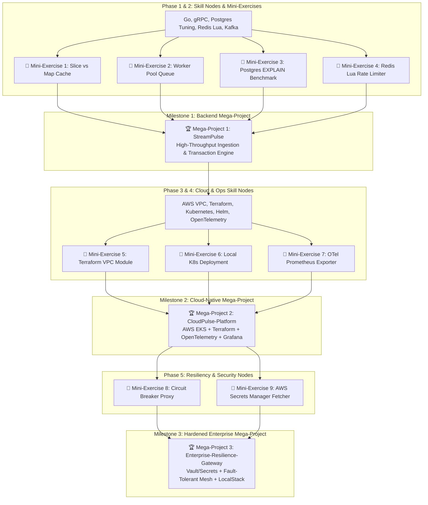

# 🚀 Hybrid Skill Roadmap: 25+ LPA Cloud-Backend & Platform SDE Blueprint

> **Target Role:** SDE-1 / Backend Engineer / Cloud Platform Engineer at Tier-1 Product Companies (Google, Amazon, Uber, Atlassian, PhonePe, Swiggy, CRED, Salesforce)  
> **Timeline:** August 2026 – March 2027  
> **Learning Methodology:** **roadmap.sh Hybrid Model** — Isolated concept-focused Mini-Exercises for individual skill nodes + Periodic Milestone Mega-Projects that synthesize all previously learned skills into production-grade applications.

---



---

## 🎯 Skill Node Matrix (roadmap.sh Aligned)

| Domain Node | Isolated Mini-Exercise Concept (Learn First) | Milestone Mega-Project Integration (Synthesize Later) |
| :--- | :--- | :--- |
| **Go & Concurrency** | Slice vs Map benchmarking, Bounded Worker Channels | Concurrent ingestion pipelines in **StreamPulse** |
| **API Protocols** | gRPC `.proto` stubs & JSON size comparison | Dual REST + gRPC endpoints in **StreamPulse** |
| **PostgreSQL & Redis** | `EXPLAIN ANALYZE` index tuning, Redis Lua rate limiter | Partitioned DB + Redis `ZSET` leaderboard in **StreamPulse** |
| **Event Streaming** | Single-topic Kafka producer & consumer script | Transactional Kafka event queue in **StreamPulse** |
| **AWS & Terraform** | Modular Terraform VPC & Subnet script | Full Infrastructure provisioning in **CloudPulse-Platform** |
| **Kubernetes & Telemetry** | Local Helm Chart & OTel Prometheus endpoint | Multi-pod EKS deployment + Jaeger tracing in **CloudPulse-Platform** |
| **Resiliency & Security** | Circuit Breaker proxy & AWS Secrets fetcher | Hardened Zero-Trust mesh in **Enterprise-Resilience-Gateway** |

---

## 🗓️ Phase Breakdown & Hybrid Learning Pipeline

### 🔹 Phase 1: Go Foundations, Concurrency & gRPC (Aug 2026 – Sep 2026)

#### Skill Nodes & Isolated Mini-Exercises
- [ ] **Go Core Internals**: Structs, interfaces, pointers, slice memory mechanics.
  - 🧩 **Mini-Exercise 1.1:** *Slice vs Map In-Memory Benchmarker* — Write a 30-line Go script comparing lookup speeds and RAM usage for 100k items.
- [ ] **Go Concurrency Primitives**: Goroutines, channels, `sync.WaitGroup`, `context.Context`.
  - 🧩 **Mini-Exercise 1.2:** *Bounded Worker Queue* — Write a 50-line Go script processing 20 HTTP requests across a pool of 5 worker goroutines with a 2-second timeout.
- [ ] **gRPC Protocols**: `.proto` schemas, Protobuf serialization, gRPC stubs.
  - 🧩 **Mini-Exercise 1.3:** *Protobuf vs JSON Payload Comparison* — Write a `.proto` definition and compare binary byte size vs JSON string representation.

---

### 🔹 Phase 2: High-Performance Storage & Event Streaming (Oct 2026 – Nov 2026)

#### Skill Nodes & Isolated Mini-Exercises
- [ ] **PostgreSQL Performance Tuning**: B-Tree, GIN indexes, composite indexes, `EXPLAIN ANALYZE`.
  - 🧩 **Mini-Exercise 2.1:** *Query Optimizer Benchmark* — Populate a 500k-row PostgreSQL table, run `EXPLAIN ANALYZE` on unindexed queries, create a B-Tree index, and measure execution time drop.
- [ ] **Redis Caching & Lua Scripts**: Redis Hashes, Sorted Sets (`ZSET`), Lua script execution.
  - 🧩 **Mini-Exercise 2.2:** *Atomic Sliding-Window Rate Limiter* — Write a Redis Lua script enforcing a 10-req/min rate limit per API key.
- [ ] **Kafka Event Streaming**: Topics, Partitions, Consumer Groups, Idempotent Consumers.
  - 🧩 **Mini-Exercise 2.3:** *Kafka Producer & Idempotent Consumer Script* — Set up a local Kafka topic in Docker, push 1,000 JSON events, and consume them with deduplication keys.

---

#### 🏆 MEGA-PROJECT 1: `StreamPulse` (Backend Milestone)
> **Goal:** Synthesize Phase 1 & 2 skills into a single high-throughput event processing backend application.  
> **Key Modules:**
> 1. Ingestion via **gRPC** and **REST** protected by **Redis Lua Rate-Limiting**.
> 2. Async event publishing to **Apache Kafka** with transactional producer guarantees.
> 3. Worker pool consumers writing to **PostgreSQL** with **B-Tree/GIN indexes** and **Redis `ZSET` leaderboards**.

---

### 🔹 Phase 3: AWS Core Infrastructure & Terraform IaC (Dec 2026 – Jan 2027)

#### Skill Nodes & Isolated Mini-Exercises
- [ ] **AWS Networking & IAM**: Multi-AZ VPC, Public/Private Subnets, NAT Gateways, ALB, IAM Roles.
  - 🧩 **Mini-Exercise 3.1:** *LocalStack AWS Test Script* — Use LocalStack to simulate creation of S3 buckets and IAM policies via AWS CLI.
- [ ] **Terraform Modules**: HCL syntax, Terraform state, reusable modules, variables.
  - 🧩 **Mini-Exercise 3.2:** *Terraform VPC Module* — Write a reusable Terraform module provisioning a 2-AZ VPC with public/private subnets and internet gateways.

---

### 🔹 Phase 4: Kubernetes & Full-Stack Telemetry (Jan 2027 – Feb 2027)

#### Skill Nodes & Isolated Mini-Exercises
- [ ] **Kubernetes Core & Helm**: Deployments, Services, Ingress, Helm Charts, HPA.
  - 🧩 **Mini-Exercise 4.1:** *Single-Service Minikube Deployment* — Deploy a Go container onto Minikube using a custom Helm chart and trigger HPA auto-scaling under load.
- [ ] **OpenTelemetry & Observability**: OTel SDK, Jaeger tracing, Prometheus metrics, Grafana dashboards.
  - 🧩 **Mini-Exercise 4.2:** *OTel Prometheus Exporter Script* — Instrument a Go HTTP endpoint with OpenTelemetry to expose `/metrics` for Prometheus scraping.

---

#### 🏆 MEGA-PROJECT 2: `CloudPulse-Platform` (Cloud & DevOps Milestone)
> **Goal:** Take `StreamPulse` and deploy it onto production cloud infrastructure with full observability.  
> **Key Modules:**
> 1. Provision **AWS EKS / ECS, RDS Postgres, ElastiCache Redis, and ALB** using **Terraform** modules.
> 2. Package services into **Helm Charts** with **Horizontal Pod Autoscaling (HPA)**.
> 3. Automate deployment using **GitHub Actions CI/CD**.
> 4. Instrument end-to-end distributed tracing in **Jaeger** and latency dashboards in **Grafana**.

---

### 🔹 Phase 5: Resiliency, Security & Production Hardening (Feb 2027 – March 2027)

#### Skill Nodes & Isolated Mini-Exercises
- [ ] **Circuit Breakers & Retries**: Closed/Open/Half-Open state machines, exponential backoff + jitter.
  - 🧩 **Mini-Exercise 5.1:** *Faulty Proxy Retry Script* — Write a Go proxy that retries failed downstream requests with randomized jitter backoff.
- [ ] **Secrets & Security**: AWS Secrets Manager / HashiCorp Vault, OAuth2 / JWT.
  - 🧩 **Mini-Exercise 5.2:** *AWS Secrets Manager Fetcher* — Fetch dynamic database passwords from AWS Secrets Manager at app startup with zero hardcoded environment variables.

---

#### 🏆 MEGA-PROJECT 3: `Enterprise-Resilience-Gateway` (Production Polish Milestone)
> **Goal:** Harden the platform against security threats and cascading outages.  
> **Key Modules:**
> 1. Integrate **AWS Secrets Manager** for dynamic zero-hardcoded secret rotation.
> 2. Wrap inter-service calls in **Circuit Breakers** and **Jitter Retries**.
> 3. Validate cloud infrastructure deployment locally using **LocalStack** cost-hygiene workflows.

---

## 📝 Resume Bullet Point Transformation

```diff
- Built FastAPI backend for processing transactions.
+ Architected 'StreamPulse', a Go/gRPC event processing backend handling 5,000+ RPS, integrated with PostgreSQL index tuning, Redis Lua rate-limiting, and Kafka queues.

- Deployed backend using Docker and AWS.
+ Provisioned 'CloudPulse-Platform' on AWS EKS using Terraform & Helm, implementing OpenTelemetry distributed tracing (Jaeger) and Prometheus/Grafana monitoring.

- Added monitoring and error handling.
+ Hardened service resiliency using AWS Secrets Manager, Circuit Breakers, and exponential backoff retry policies with randomized jitter.
```

---

## 💡 Summary Progress Checklist

- [ ] **Phase 1 Mini-Exercises** (Slice vs Map, Worker Pool, Protobuf vs JSON)
- [ ] **Phase 2 Mini-Exercises** (Postgres EXPLAIN, Redis Lua, Kafka Producer/Consumer)
- [ ] 🏆 **Mega-Project 1:** `StreamPulse` (Backend Milestone)
- [ ] **Phase 3 Mini-Exercises** (LocalStack AWS, Terraform VPC Module)
- [ ] **Phase 4 Mini-Exercises** (Helm Minikube, OTel Prometheus Endpoint)
- [ ] 🏆 **Mega-Project 2:** `CloudPulse-Platform` (Cloud-Native Milestone)
- [ ] **Phase 5 Mini-Exercises** (Jitter Retry Proxy, Secrets Fetcher)
- [ ] 🏆 **Mega-Project 3:** `Enterprise-Resilience-Gateway` (Production Hardening Milestone)
