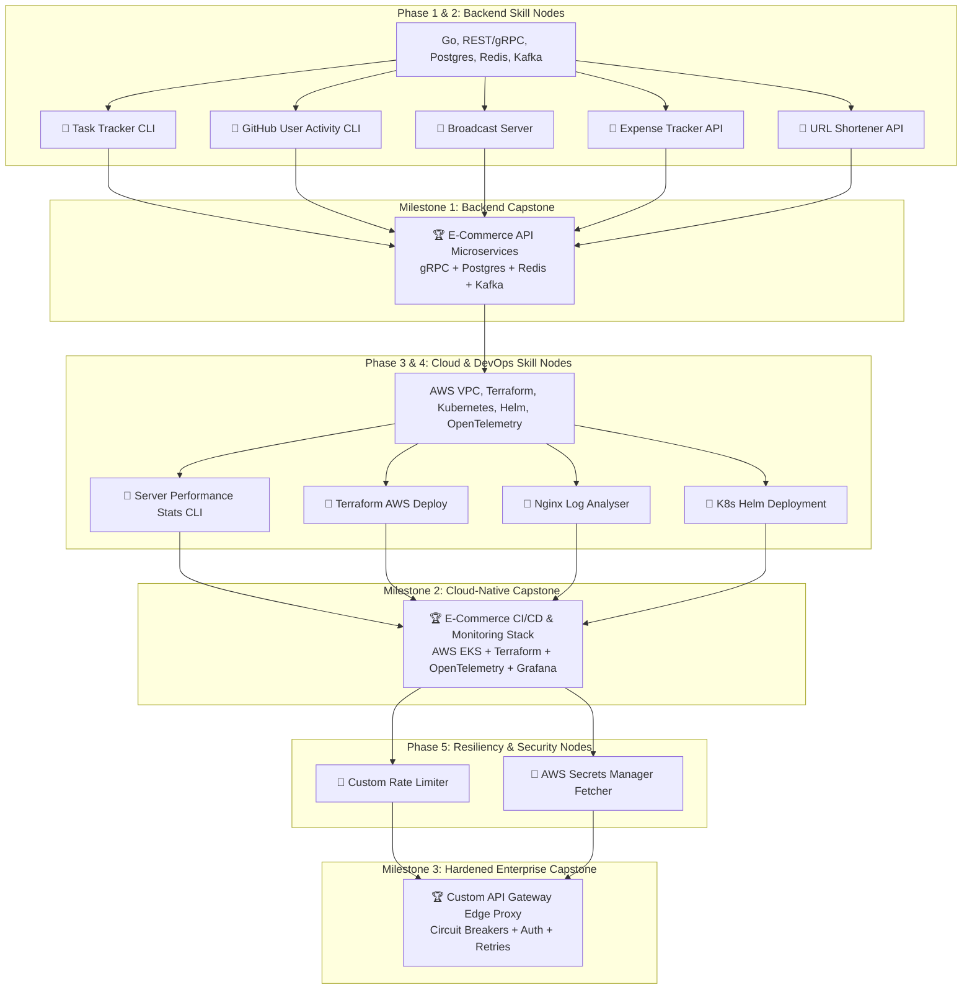

# 🚀 Official Hybrid Skill Roadmap: 25+ LPA Cloud-Backend & Platform SDE Blueprint

> **Target Role:** SDE-1 / Backend Engineer / Cloud Platform Engineer at Tier-1 Product Companies (Google, Amazon, Uber, Atlassian, PhonePe, Swiggy, CRED, Salesforce)  
> **Timeline:** August 2026 – March 2027  
> **Learning Methodology:** **roadmap.sh Hybrid Model** — Isolated concept-focused Mini-Exercises for individual skill nodes + Periodic Capstone Mega-Projects that synthesize all previously learned skills into production-grade applications. Sourced directly from standard [roadmap.sh/backend](https://roadmap.sh/backend) project ideas.

---



---

## 🎯 Skill Node Matrix (roadmap.sh Aligned)

| Domain Node | roadmap.sh Mini-Exercise (Learn First) | Capstone Integration (Synthesize Later) |
| :--- | :--- | :--- |
| **Go & File I/O** | [Task Tracker CLI](https://roadmap.sh/projects/task-tracker) | Foundational Go mechanics in **E-Commerce API** |
| **APIs & Concurrency** | [Broadcast Server](https://roadmap.sh/projects/broadcast-server) & [GitHub Activity](https://roadmap.sh/projects/github-user-activity) | Inter-service gRPC mesh in **E-Commerce API** |
| **PostgreSQL & Redis** | [Expense Tracker](https://roadmap.sh/projects/expense-tracker-api) & [URL Shortener](https://roadmap.sh/projects/url-shortener) | Partitioned DB + Caching in **E-Commerce API** |
| **AWS & Terraform** | Deploy URL Shortener to AWS manually vs IaC | Full Infrastructure provisioning via IaC in **EKS Stack** |
| **Kubernetes & Telemetry** | [Nginx Log Analyser](https://roadmap.sh/projects/nginx-log-analyser) & Local Helm Chart | Multi-pod EKS deployment + Jaeger tracing in **EKS Stack** |
| **Resiliency & Security** | [Custom Rate Limiter](https://roadmap.sh/projects/rate-limiter) & Secrets Fetcher | Hardened Zero-Trust mesh in **Custom API Gateway** |

---

## 🗓️ Phase Breakdown & Hybrid Learning Pipeline

### 🔹 Phase 1: Go Foundations, Concurrency & gRPC (Aug 2026 – Sep 2026)

#### Skill Nodes & Isolated Mini-Exercises
- [x] **Go Core Internals**: Structs, interfaces, file I/O, CLI argument parsing.
  - 🧩 **Mini-Exercise 1.1: [Task Tracker CLI](https://roadmap.sh/projects/task-tracker)** — Build a CLI to track tasks persisting state in a JSON file without external libraries.
- [ ] **HTTP Clients & REST**: Network requests, JSON parsing, error handling.
  - 🧩 **Mini-Exercise 1.2: [GitHub User Activity CLI](https://roadmap.sh/projects/github-user-activity)** — Build a CLI that fetches and displays recent activity for a specified GitHub user.
- [ ] **Go Concurrency Primitives**: Goroutines, channels, TCP sockets.
  - 🧩 **Mini-Exercise 1.3: [Broadcast Server](https://roadmap.sh/projects/broadcast-server)** — Build a concurrent server handling multiple TCP connections broadcasting messages across all clients.

---

### 🔹 Phase 2: High-Performance Storage & Event Streaming (Oct 2026 – Nov 2026)

#### Skill Nodes & Isolated Mini-Exercises
- [ ] **PostgreSQL Performance Tuning**: B-Tree/GIN indexes, composite indexes, `EXPLAIN ANALYZE`.
  - 🧩 **Mini-Exercise 2.1: [Expense Tracker API](https://roadmap.sh/projects/expense-tracker-api)** — Build an API with advanced SQL aggregations and benchmark filtering queries before and after applying B-Tree indexes.
- [ ] **Redis Caching & Key-Value Logic**: Caching, TTL, fast data retrieval.
  - 🧩 **Mini-Exercise 2.2: [URL Shortener API](https://roadmap.sh/projects/url-shortener)** — Implement a URL shortener utilizing Redis for lightning-fast lookups and TTL expirations.
- [ ] **Kafka Event Streaming**: Topics, Partitions, Consumer Groups, Idempotent Consumers.
  - 🧩 **Mini-Exercise 2.3: Idempotent Kafka Script** — Set up a local Kafka topic in Docker, push JSON events, and consume them with deduplication keys.

---

#### 🏆 MEGA-PROJECT 1: E-Commerce API (Backend Milestone)
> **Goal:** Synthesize Phase 1 & 2 skills into a distributed [E-Commerce Microservices Architecture](https://roadmap.sh/projects/ecommerce-api).  
> **Key Modules:**
> 1. Separate Go services for **Users, Products, and Orders** communicating securely via **gRPC**.
> 2. Persistent storage via **PostgreSQL** with optimized indexing.
> 3. Caching shopping carts and rate-limiting using **Redis**.
> 4. Async event publishing to **Apache Kafka** for order-processing workflows.

---

### 🔹 Phase 3: AWS Core Infrastructure & Terraform IaC (Dec 2026 – Jan 2027)

#### Skill Nodes & Isolated Mini-Exercises
- [ ] **Linux Compute & Systems**: Resource metrics, CPU, RAM, Disk.
  - 🧩 **Mini-Exercise 3.1: [Server Performance Stats CLI](https://roadmap.sh/projects/server-stats)** — Build a tool analyzing underlying compute metrics (great prerequisite for Cloud EC2).
- [ ] **AWS Networking & Terraform Modules**: Multi-AZ VPC, EC2, IAM, ALB.
  - 🧩 **Mini-Exercise 3.2: Terraform AWS Deployment** — Take the URL Shortener API, manually deploy it on AWS EC2/RDS, then wipe it and automate the entire infrastructure via a reusable Terraform module.

---

### 🔹 Phase 4: Kubernetes & Full-Stack Telemetry (Jan 2027 – Feb 2027)

#### Skill Nodes & Isolated Mini-Exercises
- [ ] **Log Aggregation & Systems**: Text parsing, analytics.
  - 🧩 **Mini-Exercise 4.1: [Nginx Log Analyser](https://roadmap.sh/projects/nginx-log-analyser)** — Build a script to aggregate Nginx logs and output the top 5 requested paths/IPs.
- [ ] **Kubernetes Core & Helm**: Deployments, Services, Ingress, Helm Charts.
  - 🧩 **Mini-Exercise 4.2: Helm Minikube Deployment** — Package the Expense Tracker API into a Helm chart and deploy it onto a local Minikube cluster.

---

#### 🏆 MEGA-PROJECT 2: E-Commerce CI/CD & Monitoring Stack (Cloud-Native Milestone)
> **Goal:** Take the E-Commerce API and deploy it onto production cloud infrastructure with full observability.  
> **Key Modules:**
> 1. Provision **AWS EKS, RDS Postgres, and ElastiCache** using **Terraform**.
> 2. Package all microservices into **Helm Charts** with **Horizontal Pod Autoscaling (HPA)**.
> 3. Automate deployment pipelines via **GitHub Actions CI/CD**.
> 4. Instrument tracing with **OpenTelemetry**, visualizing cross-service calls in **Jaeger** and latency dashboards in **Grafana**.

---

### 🔹 Phase 5: Resiliency, Security & Production Hardening (Feb 2027 – March 2027)

#### Skill Nodes & Isolated Mini-Exercises
- [ ] **Traffic Control Algorithms**: Token Bucket, Sliding Window.
  - 🧩 **Mini-Exercise 5.1: [Build your own Rate Limiter](https://roadmap.sh/projects/rate-limiter)** — Implement various rate-limiting algorithms in Go targeting Redis.
- [ ] **Secrets & Security**: Zero-hardcoded credentials.
  - 🧩 **Mini-Exercise 5.2: AWS Secrets Manager Fetcher** — Fetch dynamic database passwords from AWS at application startup.

---

#### 🏆 MEGA-PROJECT 3: Custom API Gateway Edge Proxy (Enterprise Polish Milestone)
> **Goal:** Harden the platform edge against security threats and cascading outages.  
> **Key Modules:**
> 1. Build an **Edge Proxy Gateway** in Go that sits in front of your Kubernetes cluster.
> 2. Implement your **Rate Limiter** directly inside the Gateway.
> 3. Integrate **AWS Secrets Manager** for dynamic zero-hardcoded secret rotation of JWT keys.
> 4. Wrap inter-service calls in **Circuit Breakers** and **Exponential Backoff Retries** to survive partial backend outages.

---

## 📝 Resume Bullet Point Transformation (Showcase Example)

```diff
- Built an E-commerce API for processing transactions.
+ Architected an event-driven Go/gRPC E-Commerce microservices backend, integrating PostgreSQL index tuning, Redis caching, and Kafka async workflows.

- Deployed backend using Docker and AWS.
+ Provisioned AWS EKS infrastructure using Terraform & Helm, implementing OpenTelemetry distributed tracing (Jaeger) and Prometheus/Grafana CI/CD monitoring stacks.

- Added monitoring and error handling.
+ Hardened service edge by engineering a custom API Gateway with AWS Secrets Manager integration, Circuit Breakers, and exponential backoff retry policies.
```

---

## 💡 Summary Progress Checklist

- [ ] **Phase 1 Mini-Exercises** (Task Tracker, GitHub Activity, Broadcast Server)
- [ ] **Phase 2 Mini-Exercises** (Expense Tracker, URL Shortener, Kafka Script)
- [ ] 🏆 **Mega-Project 1:** `E-Commerce API Microservices` (Backend Milestone)
- [ ] **Phase 3 Mini-Exercises** (Server Stats CLI, Terraform URL Shortener Deploy)
- [ ] **Phase 4 Mini-Exercises** (Nginx Log Analyser, Helm Minikube)
- [ ] 🏆 **Mega-Project 2:** `EKS Full CI/CD & Monitoring Stack` (Cloud-Native Milestone)
- [ ] **Phase 5 Mini-Exercises** (Rate Limiter, Secrets Fetcher)
- [ ] 🏆 **Mega-Project 3:** `Custom API Gateway Edge Proxy` (Production Hardening Milestone)
